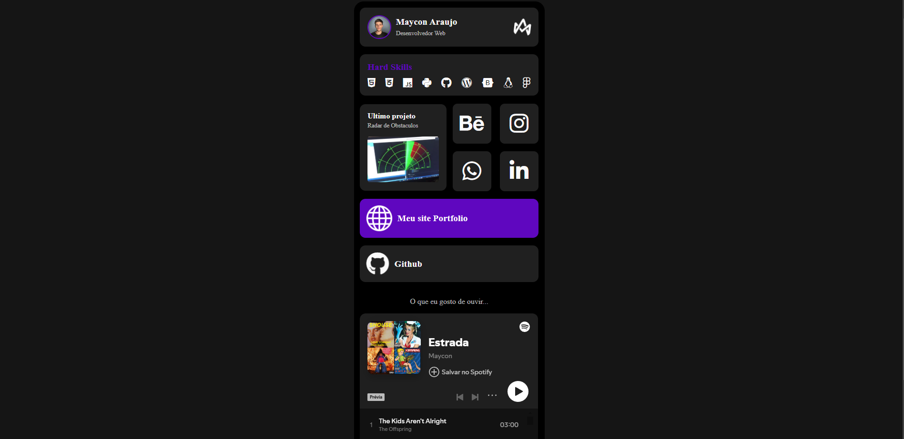

# LinkBio

## 📕 Descrição

Um site simples e responsivo para reunir links importantes.

## 👨‍💻 Autor

- Maycon Vinicius B. Araújo - ``M4ycosoft``
  

## 🧾 Licença

Este projeto está licenciado sob a Licença [MIT](./LICENSE)